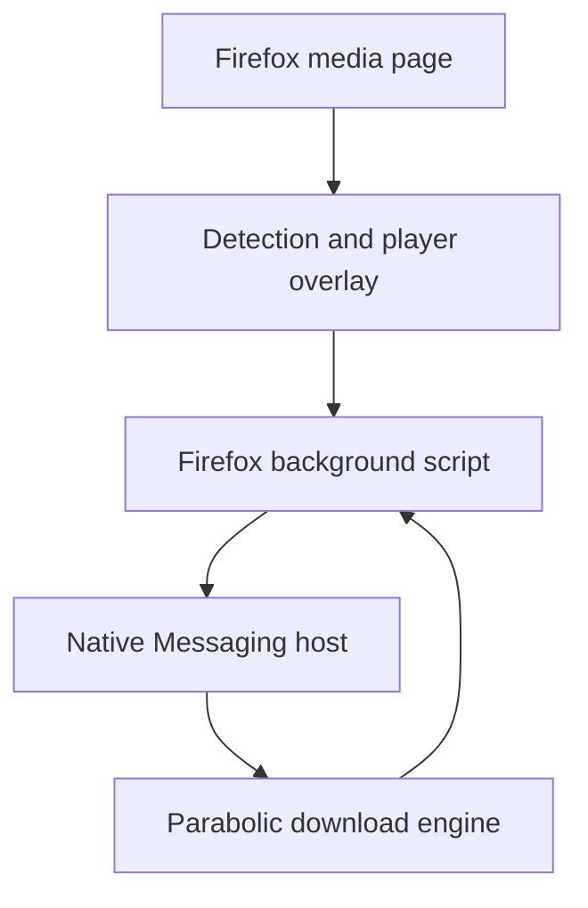

# Parabolic Media Detector for Firefox

Version `0.3.0` changes the Firefox integration from a toolbar-first workflow to an in-player workflow. When a suitable video element appears, the add-on places a Parabolic download button over the player. The desktop window is not part of the normal download path.

## Target user flow

1. The add-on detects the active video automatically.
2. `Download video` appears over the player.
3. Clicking the main button uses the saved quality preset.
4. Clicking the arrow offers 1080p, 720p, 480p, audio-only and exact formats.
5. The Firefox background script sends a JSON command to the installed Parabolic native host.
6. Progress and completion events return to the page and Firefox notifications.

The toolbar popup remains available for bridge diagnostics and unusual pages where no usable video element can be overlaid.

## Runtime architecture



No detected URL or browsing data is sent to a remote service by the add-on. URLs leave Firefox only when the user starts a download or explicitly requests the format list.

## Files

| Path | Purpose |
| --- | --- |
| `manifest.json` | Firefox permissions, stable add-on identity and content scripts. |
| `background.js` | Network detection, per-tab media cache, Native Messaging client, progress relay and legacy fallback. |
| `media-detector.js` | Detects HTML5 sources inside pages and embedded frames. |
| `media-overlay.js` | Selects the primary visible video and renders the isolated in-player interface. |
| `popup.html`, `popup.css`, `popup.js` | Secondary diagnostics and detected-source interface. |
| `options.html`, `options.css`, `options.js` | Overlay, quality, detection and compatibility preferences. |
| `NATIVE-MESSAGING-PROTOCOL.md` | Contract that the Windows host must implement in the next phase. |
| `build-addon.ps1` | Packages the development add-on on Windows. |

`utils.js` and the `icons/` directory remain required.

## Overlay behavior

The content script scores visible `<video>` elements by viewport area and gives a priority bonus to a playing video. It displays one control for the primary video in each document or embedded frame. A closed Shadow DOM isolates the interface from site CSS and page scripts.

The control follows scrolling, page mutations and responsive resizing. It can be placed in any player corner from the options page. Videos smaller than 240 by 120 CSS pixels are ignored to reduce buttons on thumbnails and advertisements.

YouTube videos use a `blob:` source through Media Source Extensions. The overlay therefore sends the stable page URL, not the temporary blob URL. The background detector still recognizes `googlevideo.com/videoplayback` traffic for diagnostics.

## Native bridge boundary

The add-on requests the native application name:

```text
com.nickvision.parabolic
```

The current upstream Parabolic release does not install this host. Until the adapted desktop release exists:

- the button and menus can be tested;
- native status reports `App update required`;
- clicking a native download displays an explanatory error;
- `Open installed Parabolic (compatibility mode)` still uses `parabolic://` explicitly.

Automatic fallback is disabled by default because it changes focus away from Firefox. It can be enabled in settings for temporary testing.

## Privacy and security

- Native requests accept only HTTP and HTTPS page/media URLs.
- Titles, format IDs and source-kind fields are length-limited before leaving the extension.
- Page-controlled JavaScript cannot call Native Messaging directly; requests pass through the isolated content script and background validation.
- Cookies are not collected or transmitted by this version.
- DRM decryption is outside the project scope.

## Local development

1. Open `about:debugging#/runtime/this-firefox`.
2. Select **Load Temporary Add-on**.
3. Select `extension/firefox/manifest.json`.
4. Open or reload a page containing a large video.
5. Start playback and verify that `Download video` appears over the player.
6. Open the arrow menu to test positioning, presets and bridge diagnostics.

The add-on can be packaged on Windows with:

```powershell
powershell -ExecutionPolicy Bypass -File .\extension\firefox\build-addon.ps1
```

The resulting unsigned XPI is intended for development and Mozilla Add-ons submission. Permanent installation in regular Firefox requires Mozilla signing.
