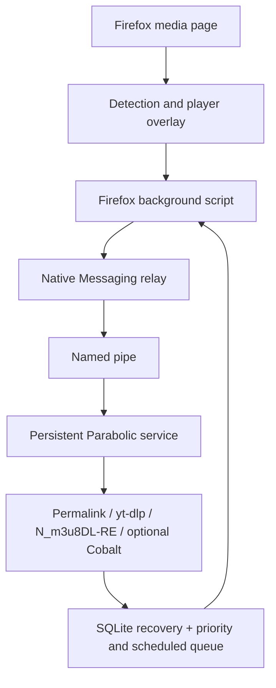

# Parabolic Download Manager for Firefox

Version `0.8.2` uses protocol v3 and the persistent Parabolic download service on Windows, native Linux and macOS. It is intentionally Firefox-only. When a suitable video element appears, the add-on places a Parabolic download button over the player. The desktop window is not part of the normal download path and Firefox may be closed after a task is accepted.

## Target user flow

1. The add-on detects the active video automatically.
2. `Download video` appears over the player.
3. Clicking the main button uses the saved quality preset.
4. Clicking the arrow offers 1080p, 720p, 480p, audio-only and exact formats.
5. The Firefox background script sends a JSON command to the installed Parabolic native host.
6. Progress and completion events return to the page and Firefox notifications.

The toolbar popup remains available for bridge diagnostics and unusual pages where no usable video element can be overlaid.

## Runtime architecture



Detected URLs remain local until the user starts a download or explicitly requests the format list. Direct and yt-dlp tasks contact only the selected media providers. If the user configures Cobalt, the requested page URL is also sent to that configured Cobalt instance for resolution.

## Files

| Path | Purpose |
| --- | --- |
| `manifest.json` | Firefox permissions, stable add-on identity and content scripts. |
| `background.js` | Network detection, per-tab media cache, Native Messaging client, progress relay and legacy fallback. |
| `media-detector.js` | Detects HTML5 sources inside pages and embedded frames. |
| `media-overlay.js` | Selects the primary visible video and renders the isolated in-player interface. |
| `popup.html`, `popup.css`, `popup.js` | Secondary diagnostics and detected-source interface. |
| `options.html`, `options.css`, `options.js` | Overlay, quality, detection and compatibility preferences. |
| `NATIVE-MESSAGING-PROTOCOL.md` | Versioned contract implemented by the Windows native host. |
| `../../Nickvision.Parabolic.NativeHost/` | Short-lived Windows stdio relay between Firefox and the named pipe. |
| `../../Nickvision.Parabolic.DownloadService/` | Persistent per-user engine that owns browser downloads and recovery. |
| `build-addon.ps1` | Packages the development add-on on Windows. |

`utils.js` and the `icons/` directory remain required.

## Overlay behavior

The content script scores visible `<video>` elements by viewport area and gives a priority bonus to a playing video. It displays one control for the primary video in each document or embedded frame. A closed Shadow DOM isolates the interface from site CSS and page scripts. For Facebook and LinkedIn, the overlay also searches the active player's surrounding post for a Reel, video, post, or activity permalink instead of relying on a generic feed URL.

The control follows scrolling, page mutations and responsive resizing. It can be placed in any player corner from the options page. Videos smaller than 240 by 120 CSS pixels are ignored to reduce buttons on thumbnails and advertisements.

YouTube videos use a `blob:` source through Media Source Extensions. The overlay therefore sends the stable page URL, not the temporary blob URL. The background detector still recognizes `googlevideo.com/videoplayback` traffic for diagnostics.

## Native bridge implementation

The add-on requests the native application name:

```text
com.nickvision.parabolic
```

The adapted desktop source contains a small `Nickvision.Parabolic.NativeHost` relay and `Nickvision.Parabolic.DownloadService`. The service asks yt-dlp to resolve the durable page permalink first. When page extraction fails and Firefox observed a recent HLS or DASH manifest, it retries that stream with the bundled `N_m3u8DL-RE` executable. Direct MP4 media remains supported, and an explicitly configured self-hosted Cobalt instance remains available for cases without a usable detected manifest. The service owns scheduled and active downloads after Firefox disconnects, renews unauthenticated Cobalt URLs at the actual scheduled start, falls back to stable page URLs after temporary CDN links expire, applies the selected retry/fragment strategy, enforces per-task bandwidth limits, relays progress, accepts pause/resume/cancel/priority commands, and can reveal a completed file in Explorer.

The Windows installer publishes the host beside Parabolic, writes its absolute-path JSON manifest, and registers `com.nickvision.parabolic` for both 32-bit and 64-bit Firefox registry views. The host does not activate the WinUI window during the normal flow.

The current public upstream Parabolic release does not install this host. Until a Windows build from this adapted source is installed:

- the button and menus can be tested;
- native status reports `App update required`;
- clicking a native download displays an explanatory error;
- `Open installed Parabolic (compatibility mode)` still uses `parabolic://` explicitly.

Automatic fallback is disabled by default because it changes focus away from Firefox. It can be enabled in settings for temporary testing.

Firefox owns only the temporary relay connection. Accepted downloads continue inside the per-user service after Firefox closes. Browser recovery records are stored separately from the desktop application's interactive recovery queue, preventing identifier collisions or duplicate restoration.

## Privacy and security

- Native requests accept only HTTP and HTTPS page/media URLs.
- Titles, format IDs and source-kind fields are length-limited before leaving the extension.
- Page-controlled JavaScript cannot call Native Messaging directly; requests pass through the isolated content script and background validation.
- The add-on never reads, copies, or transmits cookie values. When the user selects `Use Firefox session`, the local Parabolic process asks yt-dlp to read Firefox's cookie database directly.
- HTTP referrer forwarding is disabled for ordinary yt-dlp tasks by default. It is automatically limited to the selected media provider when a detected HLS/DASH manifest requires the page context.
- Proxy use is inherited from Parabolic unless the user explicitly selects a direct connection.
- A Cobalt token is stored only in Firefox local storage, is sent only to the configured Cobalt endpoint, and is never stored in Parabolic's recovery queue.
- The official shared Cobalt API is not configured automatically; the user must provide an instance they operate or are authorized to use.
- DRM decryption is outside the project scope. The integration never supplies keys or invokes the key/decryption options exposed by N_m3u8DL-RE.

## Local development

1. Open `about:debugging#/runtime/this-firefox`.
2. Select **Load Temporary Add-on**.
3. Select `extension/firefox/manifest.json`.
4. Open or reload a page containing a large video.
5. Start playback and verify that `Download video` appears over the player.
6. Open the arrow menu to test positioning, presets and bridge diagnostics.

The add-on can be packaged on Windows with:

```powershell
powershell -ExecutionPolicy Bypass -File .\extension\firefox\build-addon.ps1
```

The resulting unsigned XPI is intended for development and Mozilla Add-ons submission. Permanent installation in regular Firefox requires Mozilla signing.
