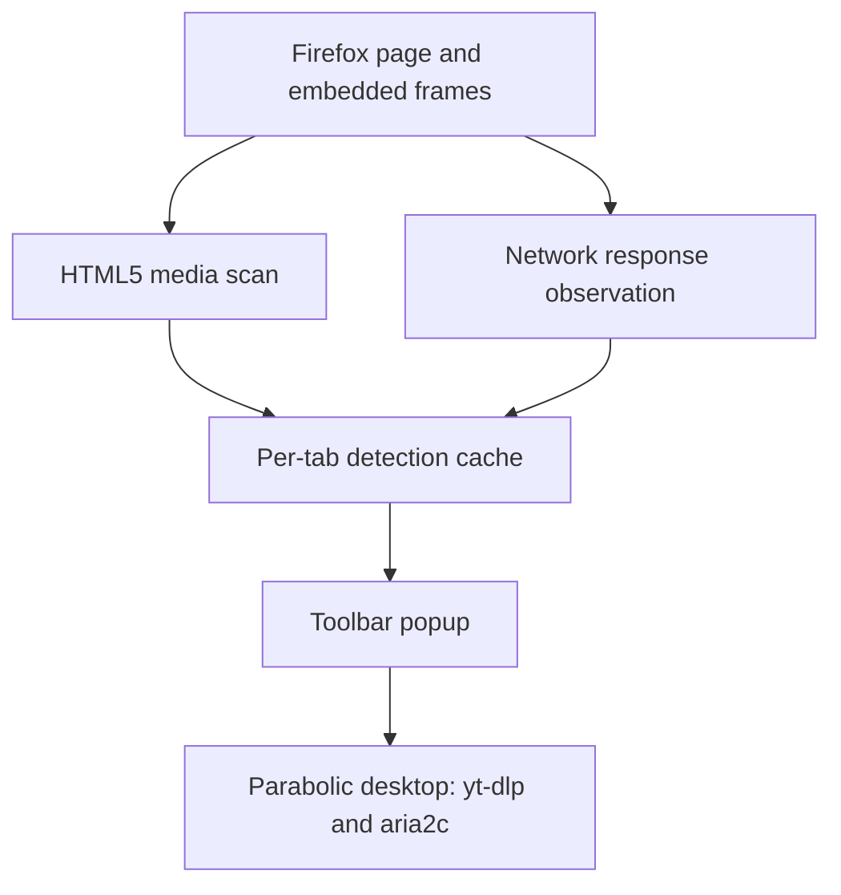

# Parabolic Media Detector for Firefox

This directory contains the Firefox-only integration for Parabolic. It detects media in the active tab and sends either the page URL or a detected media URL to the installed Parabolic desktop application.

## Runtime architecture



No browsing data or detected URL is sent to a remote service by the extension.

## Files

### Existing files replaced

| Path | Purpose |
| --- | --- |
| `extension/firefox/manifest.json` | Firefox permissions, content script, popup and add-on identity. |
| `extension/firefox/background.js` | Network detection, per-tab cache, badge, context menu and Parabolic protocol integration. |
| `extension/firefox/options.html` | Settings interface. |
| `extension/firefox/options.js` | Loads and saves Firefox settings. |
| `Nickvision.Parabolic.Shared/Controllers/MainWindowController.cs` | Parses initial and forwarded protocol URLs consistently. |
| `Nickvision.Parabolic.WinUI/App.xaml.cs` | Restores the running window and opens forwarded URLs. |
| `Nickvision.Parabolic.WinUI/Program.cs` | Selects the primary instance and forwards later launches. |

### New files

| Path | Purpose |
| --- | --- |
| `extension/firefox/media-detector.js` | Detects HTML5 media inside pages and cross-origin frames. |
| `extension/firefox/popup.html` | Toolbar popup structure. |
| `extension/firefox/popup.css` | Toolbar popup styles, including dark mode. |
| `extension/firefox/popup.js` | Lists sources and sends the selected URL to Parabolic. |
| `extension/firefox/build-addon.ps1` | Creates an unsigned development XPI on Windows. |
| `extension/firefox/ARCHITECTURE.md` | Architecture and file placement guide. |
| `Nickvision.Parabolic.WinUI/Helpers/SingleInstanceManager.cs` | Local mutex and named-pipe coordination for Windows activations. |
| `.github/workflows/firefox.yml` | Validates and packages the Firefox add-on in GitHub Actions. |

`utils.js` and the `icons/` directory remain unchanged and are still required.

## Detection strategy

The extension combines two complementary methods:

1. `webRequest.onHeadersReceived` detects HLS manifests, DASH manifests and direct audio/video responses using their URL and `Content-Type` header.
2. A content script running in every frame inspects HTML5 media elements. This also provides useful titles and video dimensions when the browser exposes them.

Individual HLS/DASH segments such as `.ts` and `.m4s` are ignored. Up to 60 unique candidates are retained per tab. The cache is cleared when the tab navigates or closes.

## Communication with Parabolic

Version `0.2.0` reuses Parabolic's existing custom URI protocol:

```text
parabolic://example.org/video
```

The desktop application converts this back to an HTTPS URL and opens its existing add-download interface. If Parabolic is already running, the new process forwards the URL through a local named pipe, restores the existing window and opens the analysis dialog there. The first button in the popup sends the page URL to `yt-dlp`; this is normally the most reliable route for supported platforms. Direct detected streams are offered as fallbacks.

## Local development install

1. Open `about:debugging#/runtime/this-firefox`.
2. Select **Load Temporary Add-on**.
3. Select `extension/firefox/manifest.json`.
4. Open a page containing a video and start playback.
5. Click the Parabolic toolbar icon.

Parabolic must be installed and its `parabolic://` protocol registered for the download buttons to open the desktop application.

## Build the development XPI on Windows

Run from PowerShell:

```powershell
powershell -ExecutionPolicy Bypass -File .\extension\firefox\build-addon.ps1
```

The script writes the package to `dist/parabolic-media-detector-<version>-unsigned.xpi`. Firefox release builds require Mozilla signing for permanent installation. The unsigned package is intended for validation and submission to Mozilla Add-ons.

## YouTube behavior

YouTube uses Media Source Extensions and adaptive requests served from `googlevideo.com`. The Firefox extension recognizes `videoplayback` traffic, groups the audio and video requests into one YouTube candidate and sends the stable watch-page URL to Parabolic. The temporary range URLs are deliberately not offered for direct download.

## Current boundary

- DRM-protected media is intentionally unsupported.
- Signed stream URLs can expire; in this case, send the page URL instead.
- Some direct streams require cookies or a `Referer`; `yt-dlp` page extraction is preferred for them.
- This version does not intercept ordinary non-media downloads.
